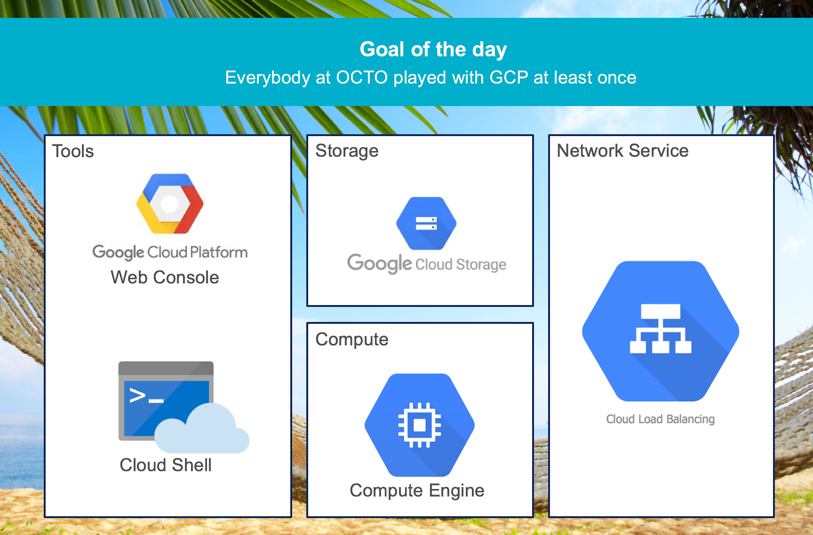
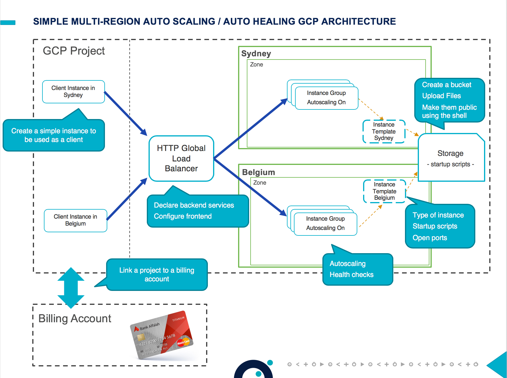

# Google Cloud - Compute Engine - Lab

This lab is part of the [foundations trainings](https://github.com/ealliaume/foundations) in place at [OCTO Technology Australia](http://careers.octo.com.au/).

## Overview of this lab

In this quick lab, we will play with Google Cloud Compute Engine.

At the end of the lab you will be able to:
- **create buckets and files** on Google Cloud Storage, and make some file public
- **create a compute engine instance** on Google Compute Engine
- **create instance templates** and **instance groups** and play with auto scaling
- **configure and use a **multi-regions load balancer**

This lab should take approximately 60 minutes.
You will need to use you own google cloud account.

## What is Google Compute Engine

Google Compute Engine (GCE) is the Infrastructure as a Service (IaaS) component of Google Cloud Platform. 
Google Compute Engine enables users to launch virtual machines (VMs) on demand. 
VMs can be launched from the standard images or custom images created by users. 

Let's start with a bit of terminology, your applications will use:
- vm, a virtual machine
- instance templates, convenient way to save a VM instance's configuration so you can use it later to create new VM instances or groups of VM instances
- managed instance groups, uses an instance template to create a group of identical instances. Compute Engine offers two different types of instance groups: managed and unmanaged instance groups, we will focus on managed instances group here. 

In this Lab, we will focus on App Engine Flexible environment.

## Target Architecture

## The Lab - step by step

### 0. Prerequisites

#### Create a project on GCP and activate billing

- Google to the [Google Cloud console](https://console.cloud.google.com)
- Click on Project List (in the header next to the Google Cloud Platform Logo), the "Create Project"
- Give it a "Name", select a billing account, then use the "Create" button

For more information about this prerequisite step please refer to the [official documentation](https://cloud.google.com/resource-manager/docs/creating-managing-projects#creating_a_project).

############################## TODO ########################

Please package the content from this google doc in this repository : https://docs.google.com/document/d/10LHRw6MwS4vCxcXYR3wqR3oQk7g85HVEMRNHIJHx1mA/edit

